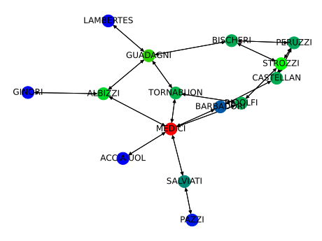
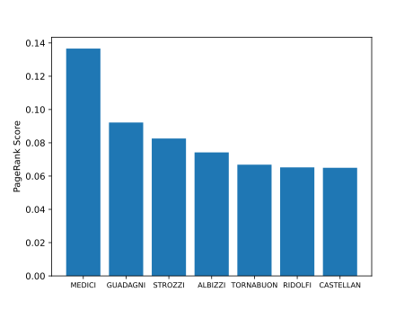

# pagerank-with-dask

This project contains an implementation of the PageRank algorithm using the Dask framework
for parallel computing as well as some methods for visualizing the obtained results.

The project also contains three sample datasets that can be used to test the implementation.

## How to Run
run `pip -r requirements.txt` to install the requirements.

Running `python3 pagerank-with-dask --help` prints the instructions on how to customize
the parameters of the implementation when running:
```
usage: pagerank-with-dask [-h] [--id-graph ID_GRAPH] [--n-iterations N_ITERATIONS] [--damping-factor DAMPING_FACTOR] [--scheduler {distributed,multiprocessing,processes,single-threaded,sync,synchronous,threading,threads}]
                          [--n-partitions N_PARTITIONS] [--n-top-print N_TOP_PRINT] [--plot] [--plot-heatmap] [--n-top N_TOP] [--plot-path PLOT_PATH]
                          graph_path {ORA,OF-routes,LNA}

positional arguments:
  graph_path            path to the file containing the graph specification
  {ORA,OF-routes,LNA}   format in which the graph is specified

optional arguments:
  -h, --help            show this help message and exit
  --id-graph ID_GRAPH   id of the graph to parse if using ORA format
  --n-iterations N_ITERATIONS
                        number of PageRank algorithm iterations to perform
  --damping-factor DAMPING_FACTOR
                        damping factor value
  --scheduler {distributed,multiprocessing,processes,single-threaded,sync,synchronous,threading,threads}
                        scheduler for Dask computations
  --n-partitions N_PARTITIONS
                        number of partitions to use
  --n-top-print N_TOP_PRINT
                        how many nodes and their PageRank scores to display when printing the results
  --plot                plot the results
  --plot-heatmap        plot the graph PageRank scores heatmap visualization
  --n-top N_TOP         number of top nodes by PageRank scores to include in the plot
  --plot-path PLOT_PATH
                        path to the directory for storing the result plots
```
## Examples of Results

Running our implementation as:
`python3 `

prints the following:

```
Top 7 nodes by their PageRank scores:
Node Name      PageRank Score
-----------  ----------------
MEDICI              0.136639
GUADAGNI            0.0922016
STROZZI             0.0825825
ALBIZZI             0.0742242
TORNABUON           0.0668498
RIDOLFI             0.0652311
CASTELLAN           0.0649862
```

And produces the following plots in the specified folder:



